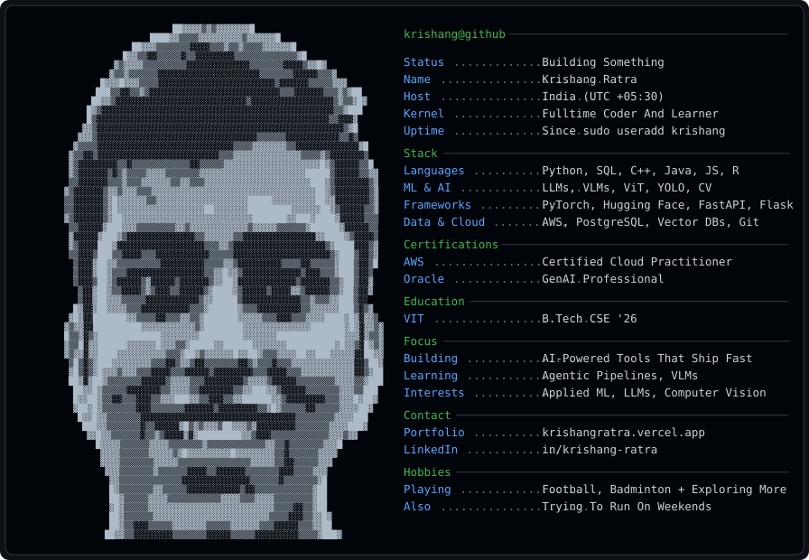

---

  

---

## `~/projects`

<table>
<tr>
<td width="50%" valign="top">

### [SkyPredict](https://github.com/krishang-r/SkyPredict)
`Python` · `Random Forest` · `Next.js`

Real-time flight fare prediction over 150,000+ records, hitting 87% accuracy at booking time. Engineered features from historical pricing to handle real-world variability, with an LLM-powered chatbot layered on for interactive queries.

</td>
<td width="50%" valign="top">

### [itr-rag-assistant](https://github.com/krishang-r/itr-rag-assistant)
🚧 currently working on this
A RAG-based assistant — details coming as it takes shape.
</td> </tr> <tr> <td width="50%" valign="top">

</td>
</tr>
<tr>
<td width="50%" valign="top">

### [coldmail-autopilot](https://github.com/krishang-r/coldmail-autopilot)
`JavaScript` · local-first

Sends templated cold emails to hiring teams. Guesses company email patterns, randomizes send scheduling so it doesn't look like a blast, and keeps templates reusable.

</td>
<td width="50%" valign="top">

### [meet-dashboard](https://github.com/krishang-r/GMeet-Dashboard)
`TypeScript` · productivity

A dashboard to consolidate every Google Meet in one place — not just the ones pre-scheduled on Calendar, but the instant recurring calls with the same people that nothing else tracks.

</td>
</tr>
</table>

  More in the <a href="https://github.com/krishang-r?tab=repositories">repos tab</a>.

---

## `~/toolbox`

<b>Languages</b>

          

 

<b>ML & Frameworks</b>

            

 

<b>Data, Cloud & Tools</b>

                  

  

---

## `~/stats`

 

  

 

---

